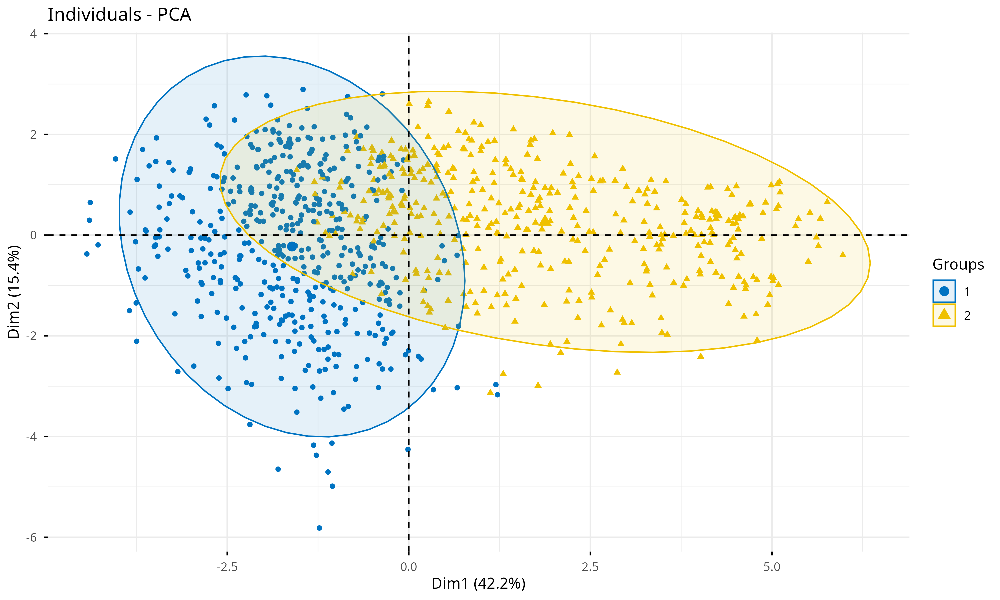
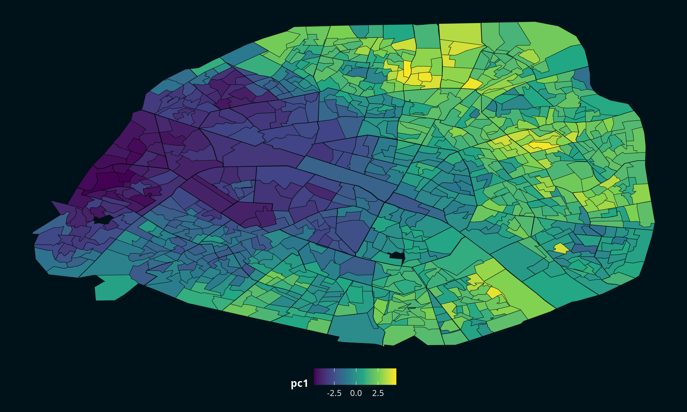
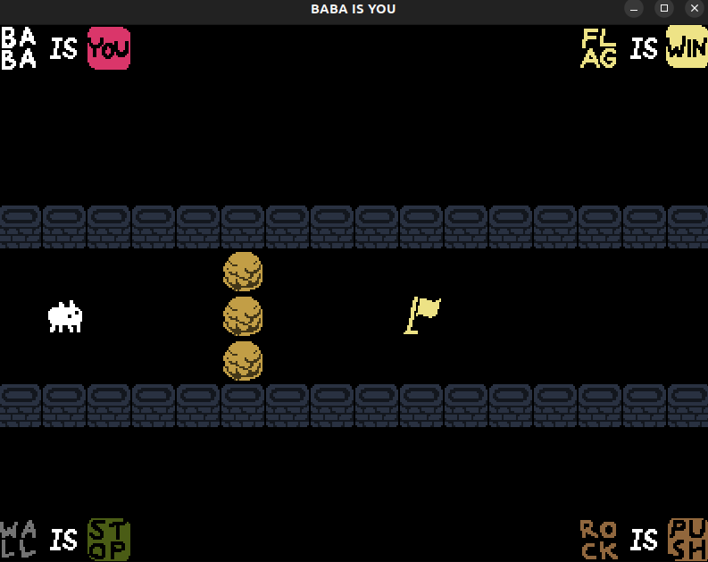

# Data Scientist

#### Technical Skills: Python, R, SQL, Machine Learning, Deep Learning, Pytorch, Scikit-learn, SQL, PySpark, Numpy, Pandas, Statistics, optimization, C++, Git, Docker

## Education
- M.S., Mathematics applied to Data Science	| Université Paris Cité (_Sept 2026 - Sept 2027_)
- M.S., Computer Science applied to Data Science	| Université Paris Cité (_Sept 2026 - Sept 2027_)	 			        		  		
- B.S., Mathematics | Université de Montpellier (_June 2025_)
- B.S., Computer Science | Université de Montpellier (June 2025)

<!-- Ceci est un commentaire 
## Work Experience
**Data Scientist @ Toyota Financial Services (_June 2022 - Present_)**
- Uncovered and corrected missing step in production data pipeline which impacted over 70% of active accounts
- Redeveloped loan originations model which resulted in 50% improvement in model performance and saving 1 million dollars in potential losses

**Data Science Consultant @ Shawhin Talebi Ventures LLC (_December 2020 - Present_)**
- Conducted data collection, processing, and analysis for novel study evaluating the impact of over 300 biometrics variables on human performance in hyper-realistic, live-fire training scenarios
- Applied unsupervised deep learning approaches to longitudinal ICU data to discover novel sepsis sub-phenotypes
-->

## Projects

### Voting Data Analysis with Machine Learning

**Role:** Data Science / Machine Learning
**Context:** University project - Université Paris Cité
**Date:** 2026
**Repository:** [GitHub repository](https://github.com/abdjinantanon/MA7BY020-2026-2)  Private repository — access can be provided upon request.

Statistical analysis of voting patterns in Paris using polling-station-level electoral data collected from multiple open-data sources. The project focused on applying matrix factorization and multivariate statistical methods to identify patterns and relationships between polling stations across different elections.

### Key contributions

* Designed an **extraction pipeline** to collect electoral results and polling-station data from multiple open-data sources.
* Integrated voting data from different types of elections, including **municipal, regional, parliamentary, European, and presidential elections**.
* Built a **data cleaning pipeline** to harmonize candidate and party names, electoral categories, and voting-related variables across elections and years.
* Restructured electoral results into **polling-station × candidate/party matrices** suitable for statistical analysis.
* Applied **Principal Component Analysis (PCA)** to voting data from different elections.
* Used **Correspondence Canonical Analysis (CCA)** to compare voting patterns across different elections.
* Performed **clustering of polling stations** using multiple approaches, including K-means and hierarchical clustering.
* Compared clustering configurations using different initializations, distance measures, and hierarchical linkage methods.
* Applied **linear regression models** to study relationships between voting results across different elections.
* Used geographic information to visualize spatial patterns in voting results, including **choropleth maps**.
* Compared and interpreted the results of different multivariate analysis and clustering methods.

### Methods & Topics

* Principal Component Analysis (PCA)
* Canonical Correlation Analysis (CCA)
* K-means Clustering

* Hierarchical Clustering
* Linear Regression
* Multivariate Statistical Analysis
* Geographic Data Analysis
* Data Cleaning & Harmonization
* Data Extraction Pipelines
* Choropleth map

### Technologies

**R · dplyr · ggplot2 · sf · factoextra · CCA · corrplot · car· Statistics · Data Analysis · PCA · CCA · Clustering · Regression · Parquet · Arrow · Geographic Data**

**Data sources:** Paris Open Data · data.gouv.fr · OpenDataSoft · Île-de-France Open Data

---

### Student Grade Management & Analytics Platform

**Role:** Developer
**Context:** Research project (TER) — Université de Montpellier
**Date:** 2025
**Repository:** [GitHub repository](#) Private repository — access can be provided upon request.

Designed and developed a web application for managing, analyzing, and visualizing student grade records. The project focused on processing large volumes of heterogeneous and sensitive academic data.

#### Key contributions

* Designed data processing workflows for large volumes of student records.
* Cleaned, interpreted, and normalized heterogeneous and unstructured data.
* Identified and reconstructed data structures from inconsistent academic information.
* Developed features for managing, analyzing, and visualizing student grade data.
* Worked with sensitive academic data while maintaining a structured and reliable data-processing pipeline.

**Technologies:** Python · FastApi · Pandas · PDFMiner · OpenPyXL · Data Processing · Data Analysis · Web Development · Git

---

### COVID-19 in Europe — Data Analysis

**Role:** Data Analyst
**Context:** University project - Université Paris Cité
**Date:** 2026
**Repository:** [GitHub](https://github.com/abdjinantanon/MA7BY020-2026-1) Private repository — access can be provided upon request.

Analysis of the evolution of the COVID-19 pandemic across European countries using epidemiological, vaccination, and geographic data. The project aimed to identify trends and compare the impact of the pandemic across different European regions.

<iframe
  src="assets/images/animation.html"
  width="100%"
  height="600"
  frameborder="0">
</iframe>

#### Key contributions

* Collected and processed COVID-19 data covering cases, deaths, and vaccinations across European countries.
* Integrated epidemiological data with NUTS geographic and regional data.
* Cleaned and transformed heterogeneous datasets for statistical analysis.
* Analyzed the temporal evolution of COVID-19 indicators across European countries and regions.
* Compared pandemic-related indicators between different geographical areas.
* Produced data visualizations to highlight trends and regional differences.
* Generated a reproducible HTML report and presentation using Quarto.

**Technologies:** R · Data Analysis · Statistical Analysis · Data Visualization · Quarto

**Data sources:** [Our World in Data](https://docs.owid.io/projects/etl/api/covid/#download-data)

---

### Linear Programming & Optimization

**Role:** Developer
**Context:** University project - Université Paris Cité - 4 practical assignments
**Date:** 2026
**Repository:** [GitHub](https://github.com/abdjinantanon/programmationLineaire) Private repository — access can be provided upon request.

Implementation and experimental analysis of several optimization algorithms and mathematical methods through a series of four practical assignments. The project covered exact, heuristic, approximation, and dynamic programming approaches to different combinatorial optimization problems.

#### Key contributions

* Implemented an **Integer Linear Programming (ILP)** approach to solve the Set Cover problem.
* Developed and evaluated **greedy and approximation algorithms**, including frequency-based and randomized rounding methods.
* Implemented algorithms related to the **Hermite Normal Form** and tested their behavior on matrices of different sizes.
* Implemented and compared several approaches to the **Knapsack Problem**, including different algorithmic strategies.
* Conducted experimental analyses to compare algorithms in terms of **execution time, memory usage, and solution quality**.
* Implemented the **LLL algorithm** and applied it to the Subset Sum problem.
* Implemented a **dynamic programming** approach for Subset Sum and compared its performance with the LLL-based approach.
* Developed configurable test generators to evaluate algorithms under different problem sizes, distributions, and parameters.

#### Topics

* Integer Linear Programming (ILP)
* Combinatorial Optimization
* Set Cover
* Knapsack Problem
* Subset Sum
* Dynamic Programming
* Greedy Algorithms
* Approximation Algorithms
* LLL Algorithm
* Algorithm Analysis & Complexity

**Technologies:** Python · Algorithms · Mathematical Optimization · Complexity Analysis

---

### Large-Scale NLP & Stylometric Analysis with Apache Spark

**Role:** Data Scientist / Big Data Developer
**Context:** University project
**Date:** 2026
**Repository:** [GitHub](https://github.com/abdjinantanon/IFEBY310-2026-01) Private repository — access can be provided upon request.

Developed a distributed text processing pipeline using **Apache Spark** to process and analyze a large corpus of novels from the 19th-century Romantic and Realist literary periods. The project focused on building scalable ETL and NLP workflows rather than on literary interpretation.

#### Key contributions

* Built a reproducible **ETL pipeline** to collect, load, clean, and transform a corpus of novels from multiple authors.
* Processed textual data using **Spark DataFrames** and distributed Spark workflows.
* Designed and applied **Spark NLP annotation pipelines** at the novel level.
* Performed large-scale text analysis including readability metrics, word frequency analysis, and text segmentation.
* Computed **Flesch-Kincaid** and **Kandel-Moles readability indices**, including sliding-window analyses to study their stability.
* Generated **Zipf plots** to analyze word frequency distributions across documents.
* Developed methods to distinguish **dialogue and narration** within literary texts.
* Stored processed data using columnar formats such as **Parquet** and evaluated their suitability for the workflow.
* Investigated Spark execution using the **Spark UI**, identifying costly shuffles and evaluating strategies to reduce their impact.
* Analyzed the effects of **caching, persistence, and checkpointing** on pipeline performance.
* Compared different storage formats and their impact on processing performance.
* Designed the workflow to support **multi-core and distributed execution**.

#### Technologies

**Python · Apache Spark · PySpark · Spark NLP · NLP · Big Data · Spark DataFrames · Parquet · ORC · Quarto**

#### Key topics

* Distributed Data Processing
* Natural Language Processing
* ETL / Data Pipelines
* Text Mining
* Stylometric Analysis
* Big Data Optimization
* Performance Profiling
* Columnar Data Storage

---

### Paris Urban Data — Database Normalization & Data Quality

**Role:** Data Scientist / Database Developer
**Context:** University project
**Date:** 2026
**Repository:** [GitHub](https://github.com/abdjinantanon/Paris_urban_data) Private repository — access can be provided upon request.

This project focused on improving the quality and structure of two datasets published by the **City of Paris**, covering trees and green spaces.

The objective was to identify and reduce **data redundancies and anomalies** by restructuring the existing database and bringing it into **Boyce-Codd Normal Form (BCNF)**.

#### Key contributions

* Analyzed the structure and relationships between the two datasets.
* Identified **redundancies and data anomalies** within the existing database.
* Studied functional dependencies between attributes.
* Designed a normalized relational database schema.
* Decomposed relations to eliminate redundancy and update, insertion, and deletion anomalies.
* Applied **normalization principles up to Boyce-Codd Normal Form (BCNF)**.
* Verified the consistency of the resulting database structure.
* Worked with real-world urban open data provided by the City of Paris.

#### Topics

* Relational Database Design
* Database Normalization
* Boyce-Codd Normal Form (BCNF)
* Functional Dependencies
* Relational Algebra
* Data Quality
* Data Redundancy & Anomaly Detection
* Data Modeling

**Technologies:** SQL · Relational Databases · Database Design · Data Modeling

**Data sources:** City of Paris Open Data

---

### Baba Is You — C++ Game

**Role:** C++ Developer
**Context:** University project
**Date:** 2025
**Repository:** [GitHub](https://github.com/abdjinantanon/baba_is_you_game) Private repository — access can be provided upon request.

Developed a grid-based puzzle game inspired by *Baba Is You*, with a focus on object-oriented programming and software design in C++.

#### Key contributions

* Designed the game architecture using **object-oriented programming** and inheritance.
* Implemented dynamic game rules based on the state of the board.
* Managed object interactions, movement, collisions, and chained pushing.
* Implemented **undo/redo** through model state management and object copying.
* Applied C++ concepts including constructors/destructors, exceptions, operator overloading, and polymorphism.
* Used software design patterns such as **Observer** and **Model-View-Controller** where appropriate.

**Technologies:** C++ · OOP · Design Patterns · Algorithms

